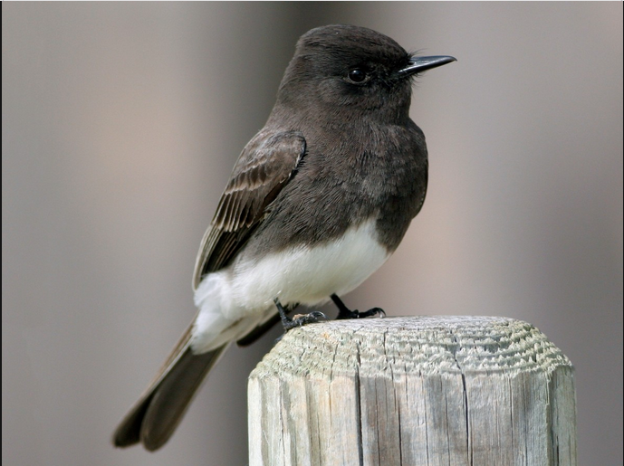
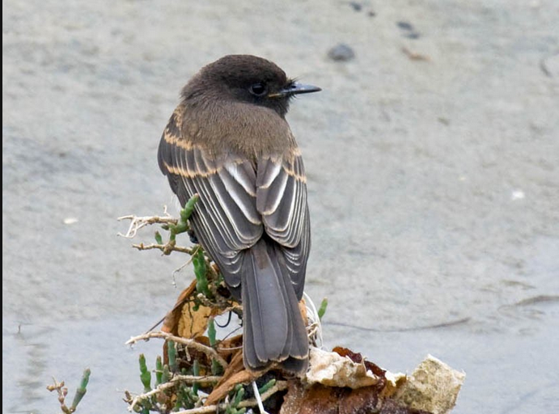

**Especie** : *Sayornis nigricans*, Tyranidae, conocida como “mosqueros de agua”

**Distribución y hábitat** : Este se ubica desde con los cursos de agua dulce de California (Estados Unidos) hasta el norte de Argentina, ya que presenta hábitos semiacuáticos y raramente se encuentra lejos del agua (Hernández *et al*.,  2010). Además de esos requerimientos del hábitat se ha documentado que ocupan de lugares sin vegetación densa, pero de algunas ramas o piedras para poder posar para cazar a sus presas (Angélica Hernández, Felipe A. Estela, 2010). Esta ha a pesar de considerarse una especie bioindicadora,  en Costa Rica se ha observado en lugares fragmentados con degradación ambiental, como en San José, o como se observó en la gira, que este se encontraba en las zonas ganaderas de Coris (Quesada-Acuña. *et al*, 2015).

**Descripción morfológica** : Mide 15.5 cm. y pesa 21 grs. Es negruzco, de tamaño mediano, y en raras ocasiones se encuentra lejos del agua. Los adultos muestran la cabeza, cuello y la mayor parte de la región inferior entre negro opaco y negro pizarra y el centro del abdomen blanco. Los flancos y las coberteras infracaudales son gris tiznado y el resto de la región superior es pizarra negruzco. Presentan 2 barras alares grises y las secundarias y terciales con un borde grisáceo. La cola es negruzca, con el vexilo externo de las timoneras más externas bordeado de blanco, y el pico y las patas son negruzcas. Los especímenes juveniles presentan el plumaje sobre todo negro parduzco apagado, el abdomen y las barras alares entre café canela opaco y café anteado y las plumas de la espalda y la rabadilla con flecos café pálido (Aves de Costa Rica)

**Comportamiento y alimentación** : Su nido consiste en una taza de paredes gruesas construido de arcilla o barro seco, fortalecido con fragmentos vegetales y forrado con zacate delgado, raicillas y unas pocas plumas; lo adhieren tanto a una superficie vertical debajo de un puente como a una roca saliente. Ponen 2 ó 3 huevos blancos, algo manchados con café rojizo. Se reproducen de marzo a mayo. Captura libélulas y otros insectos en el aire al salir volando hacia arriba y abajo, con frecuencia desde una piedra en medio de una quebrad, o los recoge del barro o del piso de cemento utilizado para secar café al lanzarse desde un poste de cerca, alambre u otro lugar de observación. Se introduce en los portales de las viviendas para atrapar a los insectos enredados en las telarañas (Aves de Costa Rica).

{width=400px} 

Figura 3. *Sayornis nigricans* adulto foto tomada de Ebird

{width=400px} 

Figura 4. *Sayornis nigricans* juvenil foto tomada de Ebird

