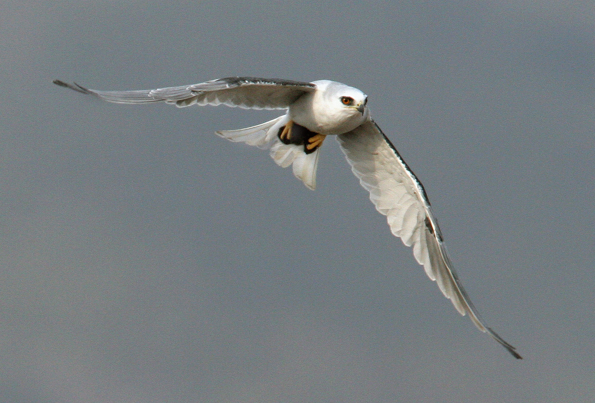

**Especie**: *Elanus leucurus*,  Accipitridae, conocida como elanio coliblanco o gavilán bailarín

 
**Distribución y hábitat**: Su distribución general, va desde el oeste de Estados Unidos, pasando por México y Centroamérica hasta el este de Suramérica hasta Argentina y Chile (Leveau, Leveau, & Pardiñas, 2002).Es una especie con poblaciones residentes en Costa Rica, prefiriendo las áreas abiertas donde es más comúnmente observado.

**Comportamiento y alimentación** Dentro de la alimentación del elanio coliblanco, Leveau et al. (2002) revisaron la alimentación a través de egagrópilas, encontrando que más del 95% de las presas son mamíferos (Rodentia y Didelphimorphia) y solamente de forma casual se consumen aves e insectos.
Durante la gira a Coris de Cartago (09/03/2019), se logró observar al elanio coliblanco, en horas de la tarde aproximadamente a las 2:30 pm, sobrevolando el área de pastizales de los humedales de Coris, solamente se observó un individuo en el sitio. El comportamiento del individuo consistió en mantenerse en vuelo sobre un punto fijo observando el suelo; luego de un tiempo aproximado de 3 min, el elanio se desplazó a otro punto repitiendo el vuelo antes descrito. Respecto a lo observado, Jaksić, Rozzi, Labra & Jiménez (1987) describieron el comportamiento de caza de Elanus leucurus que corresponde en su mayoría al comportamiento observado del individuo durante la gira.

{width=400px}

Figura 5. *Elanus leucurus* adulto foto tomada de Ebird

